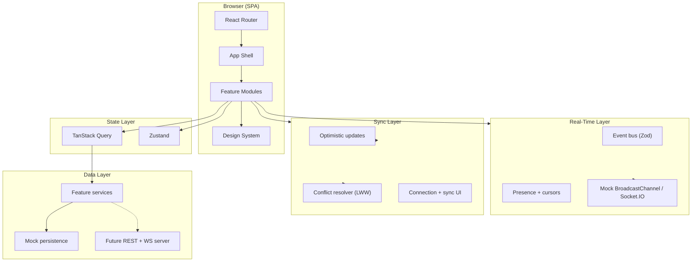

<div align="center">

# Collab Workspace

**Plataforma colaborativa en tiempo real con calidad SaaS — portfolio de ingeniería frontend avanzada.**

Espacio compartido donde varios usuarios trabajan simultáneamente en canvas, bloques, tareas y comentarios. Inspirado en FigJam, Miro y Linear — con identidad propia.

<br />

<!-- SYNC:VERSION_BADGES_START -->


<!-- SYNC:VERSION_BADGES_END -->

<br />


<br />

[**Demo en vivo**](#demo) · [**Instalación**](#instalación) · [**Arquitectura**](#arquitectura) · [**Contribuir**](#contribución)

</div>

---

## Descripción

### El problema

Las herramientas colaborativas suelen ser pesadas, difíciles de extender o dependientes de infraestructura backend desde el primer sprint. Para demostrar competencia en **tiempo real**, **sincronización optimista**, **canvas infinito** y **presencia multi-usuario**, hace falta un frontend que modele contratos reales (WebSocket, eventos, conflictos) sin bloquearse en el servidor.

### Por qué existe

**Collab Workspace** es un proyecto portfolio de referencia: demostrar colaboración en tiempo real con estándares de producción — arquitectura por features, capas `realtime/` y `sync/`, presencia con cursores, resolución de conflictos y bloques extensibles — usando transporte mock (BroadcastChannel) intercambiable por Socket.IO real.

### Enfoque

| Principio              | Aplicación                                                                                    |
| ---------------------- | --------------------------------------------------------------------------------------------- |
| **Real-time first**    | Cada feature colaborativa define contrato de evento, path optimista, conflicto y reconexión   |
| **Frontend-first**     | Mock transport + servicios API-ready; backend real solo con aprobación explícita              |
| **Feature-based**      | Dominios (`workspace`, `canvas`, `blocks`, `comments`…) con ownership claro                   |
| **Calidad invisible**  | Estados de conexión, banners de conflicto, indicadores de selección remota                    |
| **IA como acelerador** | Pipeline de diseño e ingeniería con agentes especializados; revisión humana en gates críticos |
| **Documento vivo**     | SSOT en `.claude/doc/`; roadmap por fases con master plan                                     |

---

## Características principales

### Implementadas

<!-- SYNC:IMPLEMENTED_FEATURES_START -->

- ✅ **activity** — Feed de actividad del workspace con formato de eventos
- ✅ **auth** — Autenticación mock (email + nombre) y rutas protegidas
- ✅ **blocks** — Bloques extensibles: sticky notes, texto, rectángulos y elipses
- ✅ **canvas** — Canvas infinito con pan, zoom, herramientas y multi-selección
- ✅ **comments** — Hilos de comentarios en objetos con sync cross-tab
- ✅ **home** — Landing y navegación inicial
- ✅ **settings** — Ajustes y preferencias de usuario
- ✅ **tasks** — Bloques de tareas con estado, asignado y posición en canvas
- ✅ **workspace** — CRUD de workspaces, búsqueda, miembros y sidebar (mock)

<!-- SYNC:IMPLEMENTED_FEATURES_END -->

### Próximamente

- 🔲 Backend real con Socket.IO server y persistencia
- 🔲 Autenticación OAuth
- 🔲 Command palette global
- 🔲 Centro de notificaciones in-app
- 🔲 Despliegue producción en Vercel
- 🔲 Flujos asistidos por IA

---

## Demo

| Recurso                   | Enlace                                                                                   |
| ------------------------- | ---------------------------------------------------------------------------------------- |
| **Aplicación desplegada** | _Próximamente — [Vercel](https://vercel.com)_                                            |
| **Repositorio**           | [github.com/PerecerDev/Collab-Workspace](https://github.com/PerecerDev/Collab-Workspace) |

**Credenciales de demo (entorno local):**

```
Email:  alex@collab.dev
Nombre: Alex Parker
```

> Abre la app en **dos pestañas** para ver sync en tiempo real, cursores remotos y resolución de conflictos.

---

## Tecnologías

<table>
<tr><th>Categoría</th><th>Stack</th></tr>
<tr><td><strong>Frontend</strong></td><td>React 19, TypeScript 5.8, Vite 6, Tailwind CSS 4</td></tr>
<tr><td><strong>Estado</strong></td><td>TanStack Query 5 (async), Zustand 5 (viewport, tools, conexión, tema)</td></tr>
<tr><td><strong>Real-time</strong></td><td>Capa de eventos Zod-validated; mock BroadcastChannel → Socket.IO client listo</td></tr>
<tr><td><strong>Sync</strong></td><td>Actualizaciones optimistas, last-write-wins, rollback y feedback de conflicto</td></tr>
<tr><td><strong>Interacción</strong></td><td>dnd-kit (drag en canvas), Framer Motion, React Hook Form + Zod</td></tr>
<tr><td><strong>Routing</strong></td><td>React Router 7 — lazy loading y rutas protegidas</td></tr>
<tr><td><strong>Testing</strong></td><td>Vitest 3, React Testing Library, jsdom, coverage v8</td></tr>
<tr><td><strong>Calidad</strong></td><td>ESLint 9, Prettier 3, Husky 9, lint-staged 15</td></tr>
<tr><td><strong>IA (desarrollo)</strong></td><td>Cursor, Claude Code, agentes en `.claude/agents/`, MCP</td></tr>
<tr><td><strong>Deployment</strong></td><td>Vercel (planificado), GitHub Actions (CI)</td></tr>
</table>

---

## Arquitectura

Collab Workspace es una **SPA por features** con capas dedicadas para transporte y sincronización:

```
UI → Features → realtime/ (eventos) + sync/ (optimistic) → Services → Mock API
```

Cada feature colaborativa implementa: contrato de evento, path optimista, path de conflicto, path de reconexión y path de presencia.



**Reglas clave:**

- Features no importan internals de otras features; comunicación vía `shared/` o exports públicos.
- Payloads de eventos validados con Zod antes de aplicar al estado colaborativo.
- Presencia (cursores, avatares) desacoplada del documento colaborativo.
- Servicios mock comparten interfaz con la API futura.

Ver [ARCHITECTURE.md](ARCHITECTURE.md) y [`.claude/doc/TECH_ARCHITECTURE.md`](.claude/doc/TECH_ARCHITECTURE.md).

---

## Estructura de carpetas

```
collab-workspace/
├── .claude/
│   ├── agents/              # Agentes IA especializados
│   ├── design-team/         # Pipeline de diseño
│   ├── engineering-team/    # Pipeline de ingeniería
│   ├── doc/                 # SSOT producto y arquitectura
│   └── plans/               # Master plan y planes de feature
├── .github/workflows/       # CI
├── docs/assets/             # Capturas para README
├── src/
│   ├── app/                 # Router, providers, layouts
│   ├── features/            # Módulos de dominio
│   │   ├── activity/
│   │   ├── auth/
│   │   ├── blocks/
│   │   ├── canvas/
│   │   ├── comments/
│   │   ├── home/
│   │   ├── settings/
│   │   ├── tasks/
│   │   └── workspace/
│   ├── realtime/            # Cliente WS, rooms, presencia, eventos
│   ├── sync/                # Sync optimista y resolución de conflictos
│   ├── shared/              # Design system, hooks, types, constants
│   ├── styles/              # CSS global y tokens Tailwind v4
│   └── test/                # Setup de Vitest
├── ARCHITECTURE.md
├── ROADMAP.md
└── package.json
```

| Directorio             | Propósito                                           |
| ---------------------- | --------------------------------------------------- |
| `src/realtime/`        | Transporte, dispatch de eventos, estado de conexión |
| `src/sync/`            | Aplicación optimista, rollback, banner de conflicto |
| `src/features/canvas/` | Viewport, herramientas, selección, objetos          |
| `src/features/blocks/` | Registry de tipos de bloque y renderers             |

---

## Instalación

### Requisitos previos

- **Node.js** 20+ (engines: `>=20.0.0`; Node 22 LTS recomendado)
- **npm** 10+

### Pasos

1. **Clona el repositorio**

   ```bash
   git clone https://github.com/PerecerDev/Collab-Workspace.git
   cd Collab-Workspace
   ```

2. **Instala dependencias**

   ```bash
   npm install
   ```

3. **Arranca el servidor de desarrollo**

   ```bash
   npm run dev
   ```

4. Abre [http://localhost:5173](http://localhost:5173) e inicia sesión con las [credenciales de demo](#demo).

5. **Prueba colaboración:** abre un segundo tab/navegador en el mismo workspace.

Validación completa del toolchain:

```bash
npm run typecheck && npm run lint && npm run test && npm run build
```

---

## Scripts disponibles

| Script       | Comando                 | Descripción                      |
| ------------ | ----------------------- | -------------------------------- |
| Desarrollo   | `npm run dev`           | Servidor Vite con HMR            |
| Build        | `npm run build`         | Typecheck + bundle de producción |
| Preview      | `npm run preview`       | Sirve el build local             |
| Tests        | `npm run test`          | Vitest en modo CI                |
| Tests watch  | `npm run test:watch`    | Vitest interactivo               |
| Coverage     | `npm run test:coverage` | Informe de cobertura HTML        |
| Lint         | `npm run lint`          | ESLint                           |
| Lint fix     | `npm run lint:fix`      | ESLint con auto-fix              |
| Format       | `npm run format`        | Prettier                         |
| Format check | `npm run format:check`  | Verifica formato (CI)            |
| Typecheck    | `npm run typecheck`     | Validación estricta TypeScript   |

---

## Flujo de desarrollo

### Ramas

- **Nunca desarrollar en `main`**
- Prefijos: `feature/*`, `fix/*`, `refactor/*`, `docs/*`, `test/*`, `ci/*`, `chore/*`
- **Conventional Commits** obligatorios

Ver [`.claude/doc/GIT_STRATEGY.md`](.claude/doc/GIT_STRATEGY.md) y [CONTRIBUTING.md](CONTRIBUTING.md).

### Pull Requests

- [ ] Resumen y contexto del cambio
- [ ] Capturas/video para UI (incluir demo multi-tab si afecta sync)
- [ ] Tests para eventos, sync o reglas de conflicto nuevas
- [ ] CI en verde

---

## Testing

**Filosofía:** probar contratos de eventos, resolución de conflictos y comportamiento observable — no detalles internos del transporte.

| Nivel       | Herramienta  | Alcance                                        |
| ----------- | ------------ | ---------------------------------------------- |
| Unitario    | Vitest       | Schemas Zod, helpers de sync, auth service     |
| Componente  | RTL + Vitest | Bloques, canvas controls, design system        |
| Integración | RTL          | Flujos auth → workspace → canvas (planificado) |

```bash
npm run test
npm run test:watch
npm run test:coverage
```

---

## Calidad del código

| Herramienta             | Rol                                            |
| ----------------------- | ---------------------------------------------- |
| **ESLint 9**            | TypeScript + React Hooks                       |
| **Prettier 3**          | Formato; plugin Tailwind v4                    |
| **Husky + lint-staged** | Pre-commit en archivos staged                  |
| **GitHub Actions**      | typecheck → lint → format:check → test → build |

---

## IA en el desarrollo

Desarrollo orquestado por un **equipo autónomo de agentes IA**:

| Recurso                                                                     | Descripción                                       |
| --------------------------------------------------------------------------- | ------------------------------------------------- |
| [`CLAUDE.md`](CLAUDE.md)                                                    | Project Manager — coordinación y gates de calidad |
| [`.claude/design-team/`](.claude/design-team/DESIGN-TEAM.md)                | Pipeline de diseño (12 pasos)                     |
| [`.claude/engineering-team/`](.claude/engineering-team/ENGINEERING-TEAM.md) | Pipeline de ingeniería (16 pasos)                 |

> La IA acelera diseño e implementación. Backend real, OAuth y cambios arquitectónicos requieren aprobación humana.

---

## Roadmap

| Fase        | Objetivo                                        | Estado         |
| ----------- | ----------------------------------------------- | -------------- |
| **Fase 0**  | Scaffold, design system, CI                     | ✅ Completado  |
| **Fase 1**  | Auth mock, tipos de dominio, Zod                | ✅ Completado  |
| **Fase 2**  | Workspaces CRUD, sidebar, búsqueda              | ✅ Completado  |
| **Fase 3**  | Infra real-time, presencia, cursores            | ✅ Completado  |
| **Fase 4**  | Canvas core: pan, zoom, tools, dnd-kit          | ✅ Completado  |
| **Fase 5**  | Sync optimista, conflictos, indicadores remotos | ✅ Completado  |
| **Fase 6**  | Bloques: sticky, texto, formas                  | ✅ Completado  |
| **Fase 7**  | Tareas, comentarios, activity feed              | ✅ Completado  |
| **Fase 8+** | Command palette, notificaciones, polish, deploy | 📋 Planificado |

Ver [ROADMAP.md](ROADMAP.md) y [`.claude/plans/collab-workspace-master-plan.md`](.claude/plans/collab-workspace-master-plan.md).

---

## Decisiones técnicas

| Decisión        | Elección                        | Motivo                                            |
| --------------- | ------------------------------- | ------------------------------------------------- |
| Arquitectura    | Feature-based + capas RT/sync   | Ownership claro; swap transport sin tocar UI      |
| Transporte mock | BroadcastChannel                | Demo colaborativa sin servidor; mismo contrato WS |
| Conflictos      | Last-write-wins + banner        | Simplicidad MVP; path CRDT reservado para v2      |
| Canvas DnD      | dnd-kit                         | Accesible; composable con viewport store          |
| Server state    | TanStack Query                  | Workspaces/metadata async; listo para API         |
| Client state    | Zustand                         | Viewport, tools, conexión — sin duplicar servidor |
| Styling         | Tailwind v4 + tokens semánticos | Light/dark coherente con design system            |

---

## Mantener el README actualizado

Secciones `<!-- SYNC:... -->` preparadas para sincronización de badges, features y métricas.

<!-- SYNC:PROJECT_STATS_START -->

| Métrica                    | Valor      |
| -------------------------- | ---------- |
| Versión                    | `0.1.0`    |
| Módulos en `src/features/` | 9          |
| Archivos de test           | 11         |
| Última sincronización      | 2026-07-04 |

<!-- SYNC:PROJECT_STATS_END -->

---

## Contribución

1. Abre un **issue** con el problema o mejora
2. Alineación de scope (backend, OAuth, cambios en contrato de eventos)
3. Rama desde `main` con prefijo convencional
4. CI local en verde
5. **Pull Request** con evidencia visual; demo multi-tab si afecta colaboración

---

## Licencia

Distribuido bajo licencia **MIT** _(pendiente de añadir archivo LICENSE)_.

---

<div align="center">

Construido con disciplina de ingeniería frontend y un equipo de agentes IA orquestados.

**[⬆ Volver arriba](#collab-workspace)**

</div>
